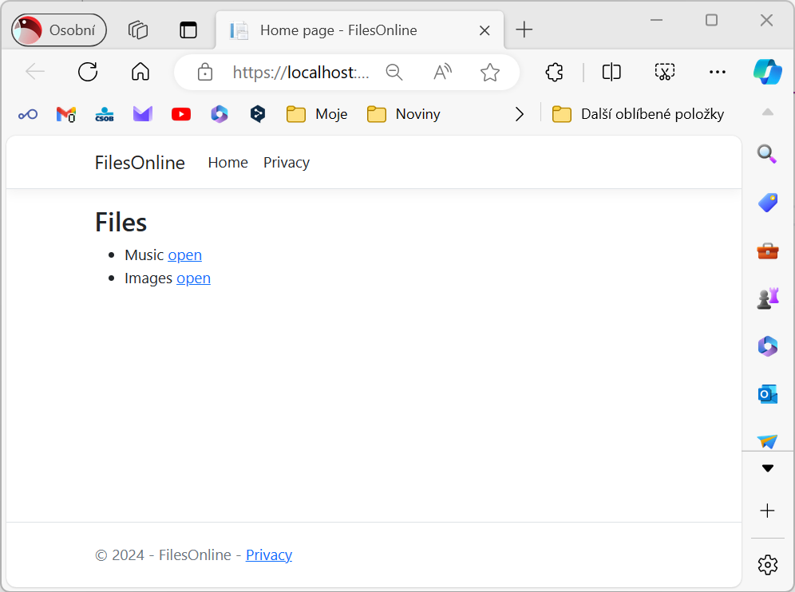
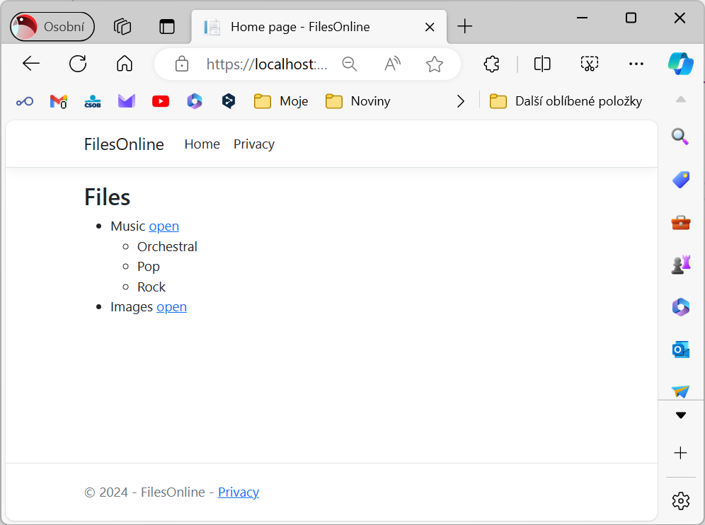
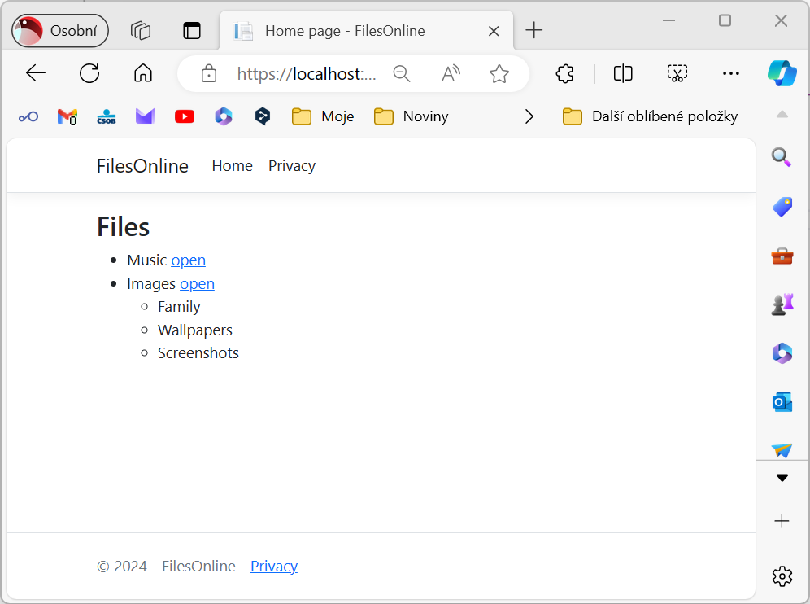
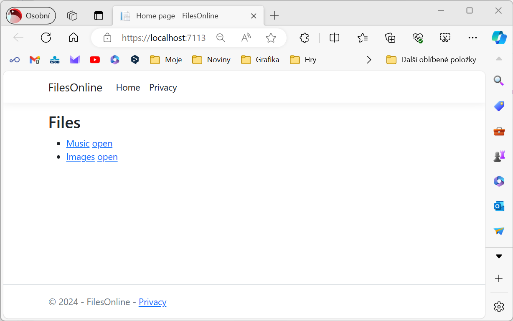
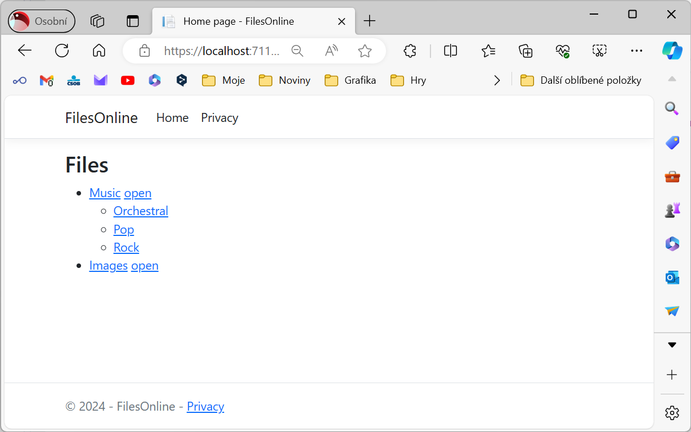
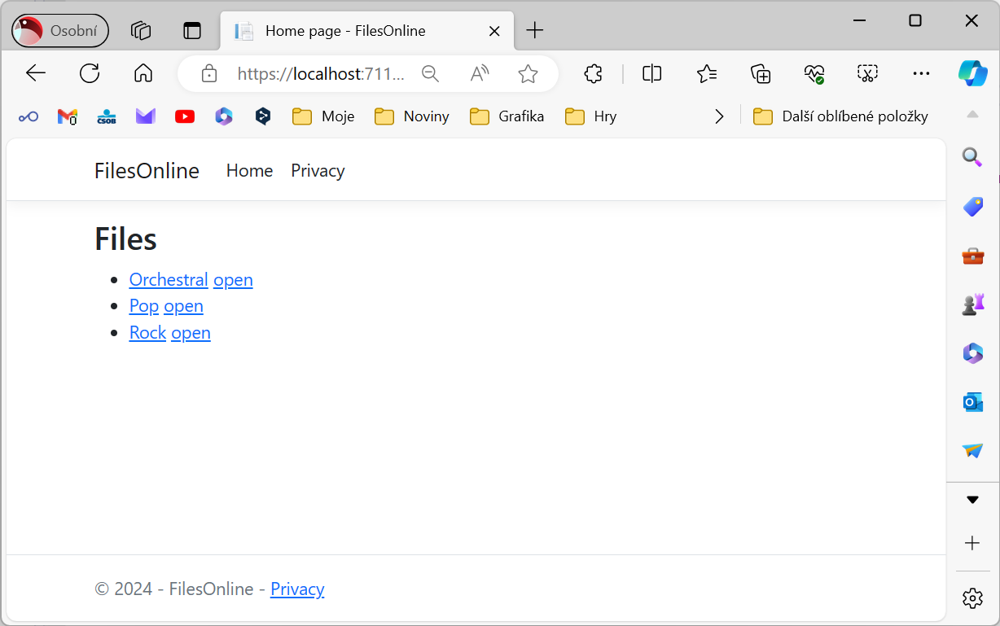

# FilesOnline

Navrhněte a vytvořte datovou strukturu pro ukládání informací o složkách uložených do stromové struktury - to znamená, že každá složka může obsahovat další složky.
Složka může mít přesně jednoho rodiče. Pak vytvořte aplikaci, která umožní touto strukturou procházet a zobrazovat seznam podsložek.

## Zadání

1. Vytvořte datovou strukturu pro ukládání informací o složkách uložených do stromové struktury. Jediná datová položka je název složky. Jak se odkážete na podložky a rodiče této složky je na Vás. Klíčem k záznamu o složce by mělo být vygenerované Guid.					
1. Zkonfigurujte Entity Framework tak, aby pracoval s databází SQLite (*files.sqlite*)
1. Přeneste navrženou strukturu do databáze
1. Naseedujte do databáze několik záznamů - ideálně ve třech úrovních
1. Data vložte do databáze - tzv. seedování
1. Modifikujte stránku index.cshtml tak, aby se dokázala připojit k databázi
1. Na stránce zobrazte seznam složek (kořenových)
1. Přidejte možnost "rozbalit" obsah složky (podsložky) tak, aby došlo k načtení jen dat z této podsložky - použijte tedy explicit loading
1. (Rozšíření zadání) Přidejte požnost procházet strukturou směrem k podsložkám přes odkazy

## Screenshoty

### Základ

### Rozšíření

## Nápověda

Vygenerování klíče Guid

    FolderId = Guid.NewGuid()

